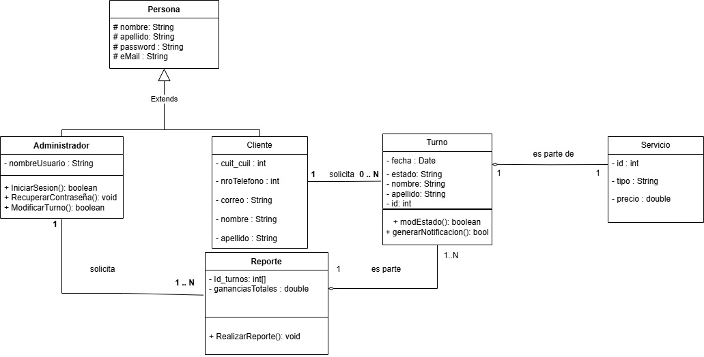

# Sistema de Gestión de Barbería

---

## Tabla de Contenidos

1. [Definición del Alcance](#definición-del-alcance)
2. [Breve Descripción del Problema](#breve-descripción-del-problema)
3. [Qué Tiene que Hacer el Sistema](#qué-tiene-que-hacer-el-sistema)
4. [Funciones del Sistema](#funciones-del-sistema)
5. [Requerimientos](#requerimientos)
   - [Requerimientos del Usuario](#requerimientos-del-usuario)
   - [Requerimientos de Sistema](#requerimientos-de-sistema)
   - [Requerimientos No Funcionales](#requerimientos-no-funcionales)
6. [Casos de Uso](#casos-de-uso)
   - [Usuario](#usuario)
   - [Administrador](#administrador)
   - [Sistema](#sistema)
7. [Pruebas de Requerimientos](#pruebas-de-requerimientos-del-sistema)
8. [Diagramas](#diagramas)

---

## Definición del Alcance
Se desarrollará un sistema para gestionar reservas en una barbería. Permitirá optimizar la experiencia del cliente y la administración del negocio, resolviendo problemas actuales como confusiones en las reservas y falta de estadísticas claras.

---

## Breve Descripción del Problema
La barbería enfrenta dificultades con la gestión manual de las reservas, lo que genera superposición de horarios, frustración entre clientes y pérdida de ingresos. El objetivo es implementar un sistema automatizado que simplifique estos procesos.

---

## Qué Tiene que Hacer el Sistema
- Reservas en línea con selección de servicios, fechas y horarios.
- Confirmaciones y recordatorios automáticos por WhatsApp.
- Gestión de datos de clientes.
- Panel de control para el administrador con calendario visual, estadísticas y reportes.

---

## Funciones del Sistema
1. Reserva de turnos en línea.
2. Selección de tipo de servicio.
3. Selección de fecha y hora con disponibilidad en tiempo real.
4. Recopilación segura de datos del cliente.
5. Confirmaciones y recordatorios automáticos.
6. Cancelación de reservas con anticipación mínima de 2 horas.
7. Panel administrativo para gestionar turnos y reportes.

---

## Requerimientos

### Requerimientos del Usuario
1. **Reserva de turnos**: Selección de servicio, fecha y hora.
2. **Gestión de servicios**: Visualización de opciones con descripciones y precios.
3. **Confirmaciones por WhatsApp**: Detalles enviados automáticamente tras la reserva.
4. **Recordatorios automáticos**: Envío de notificaciones antes de la cita.
5. **Cancelación flexible**: Hasta 2 horas antes del turno.

### Requerimientos de Sistema
- **Usuario**: Selección de servicio, calendario interactivo, formulario de datos.
- **Administrador**: Panel de control para gestionar reservas, modificar o cancelar citas, y acceder a estadísticas.
- **Sistema**: Automatización de notificaciones y recopilación de datos para reportes.

### Requerimientos No Funcionales
- **Compatibilidad y diseño responsivo**: Uso óptimo en cualquier dispositivo.
- **Seguridad**: Encriptación de datos para proteger la privacidad del usuario.

---

## Casos de Uso

### Usuario
1. Selección de servicio.
2. Selección de fecha y hora en un calendario interactivo.
3. Registro de datos personales en un formulario.
4. Confirmación de la reserva a través de WhatsApp.
5. Cancelación de la reserva mediante mensaje.

### Administrador
1. **Gestión de reservas**: Modificar o cancelar citas a través del panel.
2. **Reportes**: Visualización de estadísticas y gráficos de ganancias, servicios más solicitados, y clientes frecuentes.

### Sistema
1. Envío de recordatorios automáticos.
2. Generación de reportes.
3. Sincronización de datos en tiempo real.

---

## Pruebas de Requerimientos del Sistema

### Caso de Prueba 1: Selección de Servicio
- **ID**: CP-001
- **Descripción**: Verificar que el usuario pueda seleccionar un tipo de servicio.
- **Prioridad**: Alta
- **Resultados Esperados**: El servicio seleccionado se almacena correctamente.

### Caso de Prueba 2: Selección de Fecha y Hora
- **ID**: CP-002
- **Descripción**: Validar la selección de fechas y horarios disponibles.
- **Prioridad**: Media
- **Resultados Esperados**: Fecha y hora seleccionadas correctamente.

### Caso de Prueba 3: Registro de Datos del Cliente
- **ID**: CP-003
- **Descripción**: Comprobar que los datos del cliente se registren con éxito.
- **Prioridad**: Alta
- **Resultados Esperados**: Los datos se almacenan y se confirma la reserva por WhatsApp.

---

## Diagramas
### Diagrama de Casos de Uso

### Diagrama de Clases
